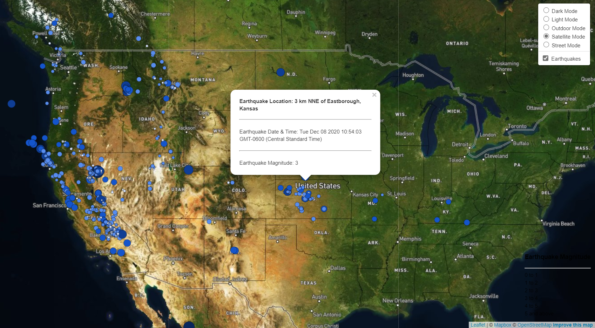

# Leaflet Challenge

## Background

Welcome to the United States Geological Survey, or USGS for short! The USGS is responsible for providing scientific data about natural hazards, the health of our ecosystems and environment; and the impacts of climate and land-use change. Their scientists develop new methods and tools to supply timely, relevant, and useful information about the Earth and its processes. As a new hire, you will be helping them out with an exciting new project!
The USGS is interested in building a new set of tools that will allow them visualize their earthquake data. They collect a massive amount of data from all over the world each day, but they lack a meaningful way of displaying it. Their hope is that being able to visualize their data will allow them to better educate the public and other government organizations (and hopefully secure more funding..) on issues facing our planet.

### Earthquake Visualization

   The USGS provides earthquake data in a number of different formats, updated every 5 minutes. I visited the [USGS GeoJSON Feed](http://earthquake.usgs.gov/earthquakes/feed/v1.0/geojson.php) page and selected a data set to visualize. By clicking on a data set, I was able to grab a URL of the JSON representation for "All Earthquakes from the Past 7 Days" to pull in the data for our visualization.

   

2. **Import & Visualize the Data**

   I created a map using Leaflet that plots all of the earthquakes from the data set based on their longitude and latitude.

   * The data markers reflected the magnitude of the earthquake in their size and color. Earthquakes with higher magnitudes will appear larger and darker in color.

   * Included popups that provide additional information about the earthquake when a marker is clicked.

